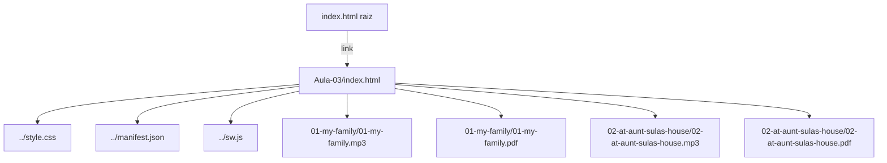

# Design — Criar Aula 03

## Visão Geral

A Aula 03 (Semana 3) do curso "Inglês com Tio Binho" segue exatamente o padrão estabelecido pela Aula 02. Trata-se de uma página HTML estática (`Aula-03/index.html`) com 3 abas (Guia, Texto 1, Texto 2), sem backend, sem frameworks — apenas HTML/CSS/JS puro servido como PWA.

Os textos da semana são:
- **Texto 1: "My Family"** — Sophia apresenta sua família, descreve membros, rotina dos pais, e usa tempos verbais (passado/presente/futuro)
- **Texto 2: "At Aunt Sula's House"** — Lis conta sobre visitas à casa da tia Sula, cachorros, atividades no jardim

Os arquivos de conteúdo (MD, MP3, PDF) já existem em `Aula-03/`. O trabalho é transformar o conteúdo dos markdowns em HTML seguindo o padrão visual e estrutural da Aula 02.

## Arquitetura

A arquitetura é idêntica às aulas anteriores: uma página HTML estática auto-contida.



Não há componentes de servidor, APIs ou banco de dados. Tudo é estático e servido via GitHub Pages ou similar.

### Decisões de Design

1. **Replicar Aula 02**: A Aula 03 segue 100% o padrão da Aula 02 (956 linhas). Mesma estrutura HTML, mesmas classes CSS, mesmo JavaScript.
2. **CSS compartilhado**: Usar `../style.css` para todos os componentes com classes definidas. Estilos inline apenas para seções específicas do guia (como na Aula 02).
3. **Palavras em destaque**: Palavras em negrito nos markdowns → `<span class="palavra-destaque">palavra</span>` em todas as seções (lado a lado, linha a linha, vocabulário).
4. **PDFs disponíveis**: Ambos os textos da Aula 03 possuem PDF, então ambas as abas terão botão de download.

## Componentes e Interfaces

### Arquivos a Criar

| Arquivo | Descrição |
|---|---|
| `Aula-03/index.html` | Página HTML da aula com 3 abas |
| `Aula-03/Leia-aqui-primeiro.md` | Guia de estudo em markdown |

### Arquivos a Modificar

| Arquivo | Modificação |
|---|---|
| `index.html` (raiz) | Desbloquear card Aula 03, atualizar progresso |
| `Todos-Os-Textos.md` | Já contém os textos da Aula 03 (verificado) |

### Estrutura do `Aula-03/index.html`

```
<!DOCTYPE html>
├── <head>
│   ├── Meta tags PWA
│   ├── Título: "Aula 03 - Tio Binho"
│   ├── Links: manifest, favicons, DM Sans, style.css
│   └── (sem CSS inline adicional)
├── <body>
│   ├── Toolbar (logo + botão voltar)
│   ├── Container
│   │   ├── Install Banner PWA
│   │   ├── Breadcrumb (Home > Aula 03)
│   │   ├── Content
│   │   │   ├── Header (título + seletor de abas)
│   │   │   ├── Aba 0: Guia (text-0)
│   │   │   │   ├── Objetivo da Semana
│   │   │   │   ├── Textos da Semana
│   │   │   │   ├── Como Estudar (6 passos)
│   │   │   │   ├── Dicas Importantes
│   │   │   │   └── Dúvidas Comuns
│   │   │   ├── Aba 1: Texto 1 - My Family (text-1)
│   │   │   │   ├── Título + Áudio + Download PDF
│   │   │   │   ├── Texto lado a lado (EN/PT)
│   │   │   │   ├── Linha a linha
│   │   │   │   └── Vocabulário (cards)
│   │   │   └── Aba 2: Texto 2 - At Aunt Sula's House (text-2)
│   │   │       ├── Título + Áudio + Download PDF
│   │   │       ├── Texto lado a lado (EN/PT)
│   │   │       ├── Linha a linha
│   │   │       └── Vocabulário (cards)
│   │   └── Back to Top button
│   ├── Footer
│   └── <script> (showText, scrollToTop, PWA, feedback, teclado)
```

### Conteúdo do Guia (Aba 0)

- **Objetivo**: Aprender vocabulário de família, descrição física, rotina doméstica e atividades do cotidiano
- **Texto 1**: My Family — tema família, adjetivos físicos, tempos verbais (yesterday/today/tomorrow). Vocabulário: parents, mother, father, brother, uncle, grandmother, short, tall, thin, funny, cute, dedicated
- **Texto 2**: At Aunt Sula's House — tema animais, atividades, expressões. Vocabulário: dog, fish, worm, grumpy, warm, crooked, watch, draw, paint, play with, look for

### Mapeamento de Palavras em Destaque

**Texto 1 — My Family**: As palavras em negrito no markdown são os verbos e vocabulário-chave. Baseado no conteúdo do markdown, não há palavras em negrito explícitas no texto narrativo (diferente da Aula 02 que tinha verbos em negrito). As palavras-destaque serão os termos de vocabulário das tabelas: parents, mother, father, brother, uncle, grandmother, short, tall, thin, funny, cute, dedicated, takes care of, makes, washes, irons, leaves, comes back.

**Texto 2 — At Aunt Sula's House**: Similarmente, as palavras-destaque serão: mother, sister, aunt, uncle, dog, fish, worm, rough, grumpy, warm, crooked, watch, draw, paint, play with, look for, feed, make holes.

### Modificações na Página Principal

1. **Card da Aula 03**: Remover `opacity: 0.6`, trocar textos para "📖 My Family" e "📖 At Aunt Sula's House", trocar botão para "📚 Acessar" com link `Aula-03/index.html`
2. **Progresso**: Semana 3 de 48 (6.25%), 3/48 semanas, 6/96 histórias, 45 semanas restantes, ~1.058/8.160 palavras

### JavaScript (idêntico à Aula 02)

Funções copiadas da Aula 02 sem alteração:
- `showText(textNumber)` — alterna abas, atualiza classes e indicador "X de 3"
- `scrollToTop()` — scroll suave ao topo
- PWA: `beforeinstallprompt`, `checkIfMobileAndShowBanner`, `showInstallPrompt`, `installApp`, `closeInstallPrompt`
- Feedback visual: scale 0.93 nos botões
- Navegação por teclado: ArrowLeft/ArrowRight nas abas

## Modelos de Dados

Não há modelos de dados persistentes. Todo o conteúdo é estático no HTML. Os "dados" são:

| Dado | Fonte | Destino |
|---|---|---|
| Texto EN "My Family" | `01-my-family/01-my-family.md` | HTML nas seções lado a lado e linha a linha |
| Texto PT "My Family" | `01-my-family/01-my-family.md` | HTML nas seções lado a lado e linha a linha |
| Vocabulário "My Family" | `01-my-family/01-my-family.md` | Cards de vocabulário |
| Texto EN "At Aunt Sula's House" | `02-at-aunt-sulas-house/02-at-aunt-sulas-house.md` | HTML nas seções lado a lado e linha a linha |
| Texto PT "At Aunt Sula's House" | `02-at-aunt-sulas-house/02-at-aunt-sulas-house.md` | HTML nas seções lado a lado e linha a linha |
| Vocabulário "At Aunt Sula's House" | `02-at-aunt-sulas-house/02-at-aunt-sulas-house.md` | Cards de vocabulário |
| Áudio Texto 1 | `01-my-family/01-my-family.mp3` | Player `<audio>` |
| Áudio Texto 2 | `02-at-aunt-sulas-house/02-at-aunt-sulas-house.mp3` | Player `<audio>` |
| PDF Texto 1 | `01-my-family/01-my-family.pdf` | Botão download |
| PDF Texto 2 | `02-at-aunt-sulas-house/02-at-aunt-sulas-house.pdf` | Botão download |


## Propriedades de Corretude

*Uma propriedade é uma característica ou comportamento que deve ser verdadeiro em todas as execuções válidas de um sistema — essencialmente, uma declaração formal sobre o que o sistema deve fazer. Propriedades servem como ponte entre especificações legíveis por humanos e garantias de corretude verificáveis por máquina.*

### Propriedade 1: Palavras-destaque presentes em todas as seções

*Para qualquer* palavra marcada como vocabulário-chave nos markdowns dos textos, essa palavra DEVE aparecer envolvida por `<span class="palavra-destaque">` em todas as seções onde o texto é renderizado (lado a lado EN, lado a lado PT, linha a linha EN, linha a linha PT).

**Valida: Requisitos 3.8, 4.8**

### Propriedade 2: Alternância de abas mostra exatamente uma aba

*Para qualquer* índice de aba válido (0, 1 ou 2), ao chamar `showText(n)`, exatamente a aba `text-n` deve estar visível (sem classe `hidden`) e as outras duas devem estar ocultas (com classe `hidden`), e o botão correspondente deve ter a classe `active`.

**Valida: Requisitos 5.1**

### Propriedade 3: Botão voltar ao topo respeita threshold de scroll

*Para qualquer* posição de scroll da página, o botão back-to-top deve ter a classe `show` se e somente se `pageYOffset > 300`.

**Valida: Requisitos 5.2**

### Propriedade 4: Navegação por teclado respeita limites das abas

*Para qualquer* aba ativa (índice 0, 1 ou 2), pressionar ArrowRight deve avançar para a próxima aba (se não for a última), e pressionar ArrowLeft deve voltar para a anterior (se não for a primeira). Nos limites (aba 0 com ArrowLeft, aba 2 com ArrowRight), a aba atual não deve mudar.

**Valida: Requisitos 5.6**

## Tratamento de Erros

Como se trata de uma página HTML estática sem interações complexas, o tratamento de erros é mínimo:

| Cenário | Tratamento |
|---|---|
| Áudio não carrega | O player HTML5 nativo exibe controles de erro padrão do navegador |
| PDF não encontrado | O link de download resulta em 404 do servidor — comportamento padrão |
| Service Worker falha | A página funciona normalmente sem cache offline — degradação graciosa |
| `beforeinstallprompt` não disparado | O banner de instalação mostra instruções manuais via `alert()` |
| JavaScript desabilitado | O conteúdo HTML é visível, mas a navegação por abas não funciona (aba 0/Guia fica visível por padrão) |

## Estratégia de Testes

### Abordagem Dual

Este projeto usa HTML/CSS/JS puro sem framework de testes configurado. A estratégia combina:

1. **Testes unitários (exemplos)**: Verificações pontuais de estrutura HTML, presença de elementos, links corretos, conteúdo esperado
2. **Testes de propriedade (PBT)**: Verificações universais sobre comportamento do JavaScript (abas, scroll, teclado, palavras-destaque)

### Biblioteca de Testes de Propriedade

Para testes de propriedade em JavaScript puro, usar **fast-check** com um test runner como **Vitest** ou **Jest**.

Configuração mínima:
- `fast-check` para geração de inputs aleatórios
- Mínimo 100 iterações por teste de propriedade
- Cada teste deve referenciar a propriedade do design

### Testes de Propriedade

Cada propriedade de corretude deve ser implementada por um ÚNICO teste de propriedade:

- **Feature: criar-aula-03, Property 1: Palavras-destaque presentes em todas as seções** — Gerar palavras-destaque aleatórias da lista de vocabulário, verificar que cada uma aparece com a classe correta em todas as seções do HTML
- **Feature: criar-aula-03, Property 2: Alternância de abas mostra exatamente uma aba** — Para qualquer índice gerado (0, 1, 2), chamar showText e verificar visibilidade
- **Feature: criar-aula-03, Property 3: Botão voltar ao topo respeita threshold** — Para qualquer valor de scroll gerado, verificar presença/ausência da classe show
- **Feature: criar-aula-03, Property 4: Navegação por teclado respeita limites** — Para qualquer sequência de teclas ArrowLeft/ArrowRight gerada, verificar que o índice da aba ativa nunca sai do intervalo [0, 2]

### Testes Unitários (Exemplos e Edge Cases)

Verificações pontuais de estrutura:
- HTML contém meta tags PWA obrigatórias
- Links para ../style.css, ../manifest.json e favicons estão presentes
- Player de áudio aponta para os MP3 corretos
- Botões de download apontam para os PDFs corretos
- Breadcrumb contém "Aula 03"
- Footer contém "Aula 03 - Tio Binho"
- Card da Aula 03 na página principal está desbloqueado
- Seção de progresso mostra valores atualizados (Semana 3, 6/96, etc.)
- Todos-Os-Textos.md contém os textos da Aula 03
- Guia de estudo (Leia-aqui-primeiro.md) contém as seções obrigatórias
