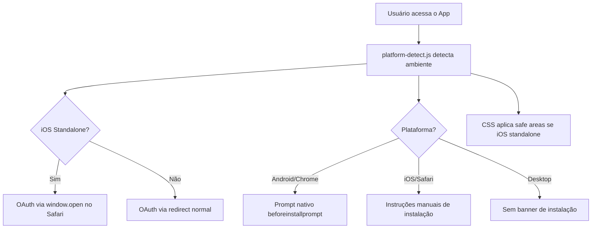
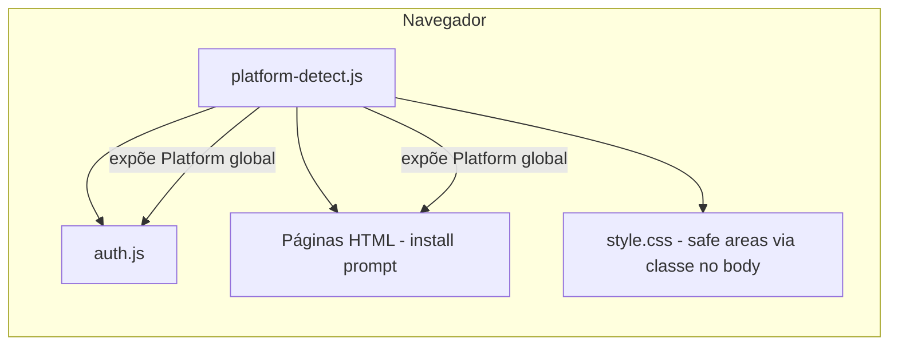

# Documento de Design — Compatibilidade Cross-Browser

## Visão Geral

Este design descreve as adaptações necessárias para que o PWA "Inglês com Tio Binho" funcione corretamente em todos os navegadores e plataformas alvo: Chrome Android, Safari iOS, Chrome Desktop e Safari Desktop. A solução mantém a arquitetura atual (HTML/CSS/JS estático, sem framework) e adiciona um módulo utilitário `platform-detect.js` que centraliza a detecção de plataforma, permitindo que os módulos existentes (`auth.js`, páginas HTML, `style.css`) adaptem seu comportamento conforme o ambiente.

Os principais problemas resolvidos são:
1. **OAuth no iOS standalone** — O fluxo de redirect do Google OAuth não funciona dentro de PWAs standalone no iOS. A solução é abrir o OAuth no Safari via `window.open`.
2. **Prompt de instalação** — O evento `beforeinstallprompt` só existe no Chrome/Android. No iOS, exibimos instruções manuais específicas.
3. **Reprodução de áudio** — Garantir que o `<audio>` funcione em todos os navegadores, com tratamento de erro amigável.
4. **Safe areas do iOS** — Usar `env(safe-area-inset-*)` no CSS para evitar sobreposição com notch e barra home.



## Arquitetura

### Visão Geral da Arquitetura

A arquitetura permanece client-side pura. O novo módulo `platform-detect.js` é carregado antes dos demais scripts e expõe um objeto global `Platform` que os outros módulos consultam para adaptar comportamento.



### Decisões de Arquitetura

| Decisão | Justificativa |
|---------|---------------|
| Módulo `platform-detect.js` separado | Centraliza detecção de plataforma em um único ponto. Evita duplicação de lógica de user agent em vários arquivos. |
| Objeto global `Platform` | Mantém o padrão do projeto (variáveis globais como `supabaseClient`, `ADMIN_EMAILS`). Sem bundler, globals são a forma mais simples. |
| `window.open` para OAuth no iOS standalone | PWAs standalone no iOS não suportam redirect OAuth corretamente — o redirect abre no Safari e não volta ao PWA. `window.open` abre no Safari e o usuário pode voltar ao PWA manualmente. |
| Classe CSS no `<body>` para safe areas | `platform-detect.js` adiciona classes como `is-ios-standalone` ao body, permitindo que o CSS aplique safe areas condicionalmente sem JS inline. |
| Instruções manuais para iOS install | iOS não suporta `beforeinstallprompt`. A única opção é orientar o usuário com instruções visuais. |
| MP3 como formato único de áudio | MP3 é suportado por todos os navegadores modernos (Chrome, Safari, Firefox, Edge). Não há necessidade de formatos alternativos. |

## Componentes e Interfaces

### 1. `platform-detect.js` — Módulo de Detecção de Plataforma

Carregado antes de todos os outros scripts. Expõe o objeto global `Platform`.

```javascript
// platform-detect.js
const Platform = (() => {
    const ua = navigator.userAgent || '';
    const isIOS = /iPad|iPhone|iPod/.test(ua) || 
                  (navigator.platform === 'MacIntel' && navigator.maxTouchPoints > 1);
    const isAndroid = /Android/i.test(ua);
    const isSafari = /^((?!chrome|android).)*safari/i.test(ua);
    const isChrome = /Chrome/i.test(ua) && !/Edge|Edg/i.test(ua);
    const isStandalone = window.navigator.standalone === true || 
                         window.matchMedia('(display-mode: standalone)').matches;
    const isMobile = /Android|webOS|iPhone|iPad|iPod|BlackBerry|IEMobile|Opera Mini/i.test(ua) ||
                     window.innerWidth <= 768;

    // Adicionar classes ao body para CSS condicional
    document.addEventListener('DOMContentLoaded', () => {
        if (isIOS) document.body.classList.add('is-ios');
        if (isAndroid) document.body.classList.add('is-android');
        if (isStandalone) document.body.classList.add('is-standalone');
        if (isIOS && isStandalone) document.body.classList.add('is-ios-standalone');
    });

    return Object.freeze({ isIOS, isAndroid, isSafari, isChrome, isStandalone, isMobile });
})();
```

**Interface exposta:** objeto global `Platform` (imutável) com propriedades booleanas.

### 2. Modificações em `auth.js` — OAuth no iOS Standalone

A função `loginComGoogle()` precisa detectar iOS standalone e usar uma estratégia diferente.

```javascript
// Dentro de loginComGoogle():
async function loginComGoogle() {
    if (Platform.isIOS && Platform.isStandalone) {
        // iOS standalone: abrir OAuth no Safari
        const { data, error } = await supabaseClient.auth.signInWithOAuth({
            provider: 'google',
            options: {
                redirectTo: window.location.origin,
                skipBrowserRedirect: true
            }
        });
        if (data?.url) {
            window.open(data.url, '_blank');
        }
        if (error) { /* exibir erro */ }
    } else {
        // Fluxo normal: redirect
        const { error } = await supabaseClient.auth.signInWithOAuth({
            provider: 'google',
            options: { redirectTo: window.location.origin }
        });
        if (error) { /* exibir erro */ }
    }
}
```

Além disso, `initAuth()` deve escutar mudanças de estado de autenticação para detectar quando o usuário retorna ao PWA após login no Safari:

```javascript
// Adicionar em initAuth():
supabaseClient.auth.onAuthStateChange((event, session) => {
    if (event === 'SIGNED_IN' && session) {
        const loginOverlay = document.getElementById('loginOverlay');
        const appContent = document.getElementById('appContent');
        if (loginOverlay) loginOverlay.style.display = 'none';
        if (appContent) appContent.style.display = '';
        exibirUsuarioNaToolbar();
    }
});
```

### 3. Modificações no Install Prompt — Cross-Platform

O código de install prompt (atualmente inline nas páginas HTML) será adaptado para usar `Platform`:

```javascript
function checkIfMobileAndShowBanner() {
    // Se já está instalado, não mostrar
    if (Platform.isStandalone) return;
    
    // Não mostrar em desktop
    if (!Platform.isMobile) return;

    // iOS: mostrar instruções específicas após delay
    if (Platform.isIOS) {
        setTimeout(() => showIOSInstallInstructions(), 2000);
        return;
    }

    // Android: aguardar beforeinstallprompt (já capturado)
    if (Platform.isAndroid && !deferredPrompt) {
        setTimeout(() => showInstallPrompt(), 2000);
    }
}

function showIOSInstallInstructions() {
    const banner = document.getElementById('installBanner');
    if (!banner || installPromptShown) return;
    
    // Trocar conteúdo do banner para instruções iOS
    banner.querySelector('h3').textContent = '📱 Instale nosso app!';
    banner.querySelector('p').innerHTML = 
        'Toque em <strong>Compartilhar</strong> (ícone ⬆️) → <strong>Adicionar à Tela Inicial</strong>';
    
    // Esconder botão "Instalar" e mostrar só "OK, entendi"
    const installButtons = banner.querySelector('.install-buttons');
    installButtons.innerHTML = `
        <button class="install-btn cancel" onclick="closeInstallPrompt()">OK, entendi</button>
    `;
    
    banner.style.display = 'flex';
    installPromptShown = true;
}
```

### 4. Tratamento de Áudio Cross-Browser

Adicionar tratamento de erro nos elementos `<audio>` das páginas de aula:

```javascript
// Adicionar nas páginas de aula (Aula-XX/index.html):
document.querySelectorAll('audio').forEach(audio => {
    audio.addEventListener('error', () => {
        const section = audio.closest('.audio-section');
        if (section) {
            const msg = document.createElement('p');
            msg.style.color = '#e63946';
            msg.style.fontWeight = '600';
            msg.textContent = '⚠️ Erro ao carregar o áudio. Tente recarregar a página.';
            section.appendChild(msg);
        }
    });
});
```

### 5. Modificações no CSS — Safe Areas do iOS

Adicionar ao `style.css` regras condicionais usando as classes adicionadas por `platform-detect.js`:

```css
/* Safe Areas para iOS Standalone */
body.is-ios-standalone .toolbar {
    padding-top: env(safe-area-inset-top);
}

body.is-ios-standalone .container {
    padding-left: max(20px, env(safe-area-inset-left));
    padding-right: max(20px, env(safe-area-inset-right));
}

body.is-ios-standalone footer {
    padding-bottom: calc(30px + env(safe-area-inset-bottom));
}

body.is-ios-standalone #installBanner {
    padding-bottom: calc(20px + env(safe-area-inset-bottom));
}
```

Adicionar `viewport-fit=cover` na meta tag viewport de todas as páginas:

```html
<meta name="viewport" content="width=device-width, initial-scale=1.0, viewport-fit=cover">
```

### 6. Compatibilidade CSS — Prefixos WebKit

Adicionar prefixos `-webkit-` onde necessário no `style.css`:

```css
/* Smooth scrolling com fallback */
html {
    scroll-behavior: smooth;
    -webkit-overflow-scrolling: touch;
}

/* Sticky toolbar com prefixo */
.toolbar {
    position: -webkit-sticky;
    position: sticky;
}
```

### 7. Estrutura de Arquivos (Novos e Modificados)

```
├── platform-detect.js       ← NOVO: detecção de plataforma
├── auth.js                  ← MODIFICADO: OAuth iOS standalone + onAuthStateChange
├── style.css                ← MODIFICADO: safe areas iOS + prefixos webkit
├── index.html               ← MODIFICADO: viewport-fit=cover + script platform-detect.js + install prompt adaptado
├── Aula-01/index.html       ← MODIFICADO: viewport-fit=cover + script platform-detect.js + audio error handling
├── Aula-02/index.html       ← MODIFICADO: idem
├── Aula-03/index.html       ← MODIFICADO: idem
├── sw.js                    ← MODIFICADO: cachear platform-detect.js
```

## Modelos de Dados

Este design não introduz novos modelos de dados. As adaptações são puramente no lado do cliente (CSS, JS) e não afetam o banco de dados Supabase.

O único "modelo" relevante é o objeto `Platform`:

```typescript
// Tipo do objeto Platform (para referência, não é TypeScript no projeto)
interface Platform {
    isIOS: boolean;       // iPhone, iPad, iPod
    isAndroid: boolean;   // Dispositivos Android
    isSafari: boolean;    // Navegador Safari
    isChrome: boolean;    // Navegador Chrome (excluindo Edge)
    isStandalone: boolean; // PWA instalado (modo standalone)
    isMobile: boolean;    // Dispositivo móvel
}
```


## Propriedades de Corretude

*Uma propriedade é uma característica ou comportamento que deve ser verdadeiro em todas as execuções válidas de um sistema — essencialmente, uma declaração formal sobre o que o sistema deve fazer. Propriedades servem como ponte entre especificações legíveis por humanos e garantias de corretude verificáveis por máquina.*

### Propriedade 1: Objeto Platform sempre tem a estrutura correta

*Para qualquer* user agent string (incluindo strings vazias, malformadas ou exóticas), o objeto `Platform` deve sempre conter exatamente as propriedades `isIOS`, `isAndroid`, `isSafari`, `isChrome`, `isStandalone` e `isMobile`, e todas devem ser do tipo booleano.

**Valida: Requisito 1.1**

### Propriedade 2: Platform classifica corretamente user agents por plataforma

*Para qualquer* user agent string de iOS/Safari, `Platform.isIOS` deve ser `true`. *Para qualquer* user agent string de Android/Chrome, `Platform.isAndroid` deve ser `true`. *Para qualquer* user agent string de dispositivo móvel, `Platform.isMobile` deve ser `true`. A classificação deve ser mutuamente consistente (ex: um user agent iOS nunca deve ter `isAndroid === true`).

**Valida: Requisitos 1.2, 1.3, 1.5**

### Propriedade 3: OAuth no iOS standalone usa window.open em vez de redirect

*Para qualquer* estado onde `Platform.isIOS === true` e `Platform.isStandalone === true`, ao chamar `loginComGoogle()`, o sistema deve invocar `signInWithOAuth` com `skipBrowserRedirect: true` e abrir a URL retornada via `window.open`, nunca redirecionando dentro do PWA standalone.

**Valida: Requisito 2.1**

### Propriedade 4: Mudança de estado de autenticação atualiza a UI

*Para qualquer* evento `SIGNED_IN` emitido pelo `onAuthStateChange` com uma sessão válida, o overlay de login deve ser ocultado e o conteúdo do app deve ser exibido.

**Valida: Requisito 2.2**

### Propriedade 5: Android com deferredPrompt usa prompt nativo de instalação

*Para qualquer* estado onde `Platform.isAndroid === true` e `deferredPrompt` não é null, ao chamar `installApp()`, o sistema deve invocar `deferredPrompt.prompt()`.

**Valida: Requisito 3.1**

### Propriedade 6: iOS sem deferredPrompt exibe instruções manuais de instalação

*Para qualquer* estado onde `Platform.isIOS === true` e `Platform.isStandalone === false` e `deferredPrompt` é null, o banner de instalação deve exibir instruções específicas para iOS (mencionando "Compartilhar" e "Adicionar à Tela Inicial").

**Valida: Requisito 3.2**

### Propriedade 7: Standalone ou desktop nunca exibe banner de instalação

*Para qualquer* estado onde `Platform.isStandalone === true` OU `Platform.isMobile === false`, o banner de instalação nunca deve ser exibido (display deve permanecer `none`).

**Valida: Requisitos 3.3, 3.4**

### Propriedade 8: Erro de áudio exibe mensagem amigável

*Para qualquer* elemento `<audio>` que dispara um evento `error`, uma mensagem de erro visível deve ser adicionada ao DOM dentro da seção de áudio correspondente.

**Valida: Requisito 4.3**

### Propriedade 9: Layout não-standalone não é afetado por safe areas

*Para qualquer* estado onde o `<body>` NÃO possui a classe `is-ios-standalone`, os estilos de safe area (padding com `env(safe-area-inset-*)`) não devem ser aplicados à toolbar, container ou footer.

**Valida: Requisito 5.3**

## Tratamento de Erros

| Cenário | Comportamento | Impacto no Usuário |
|---------|---------------|-------------------|
| User agent não reconhecido | `Platform` retorna `false` para todas as flags de plataforma. Comportamento padrão (Chrome desktop) é usado. | Nenhum — app funciona normalmente com comportamento padrão. |
| OAuth falha no iOS standalone | Exibe mensagem de erro na tela de login. Usuário pode tentar novamente. | Precisa tentar novamente ou abrir no Safari. |
| OAuth redirect não retorna ao PWA standalone | `onAuthStateChange` detecta sessão quando o usuário volta ao PWA. Se não detectar, o usuário pode recarregar o app. | Pode precisar recarregar o app manualmente. |
| `beforeinstallprompt` não dispara no Android | Banner é exibido após timeout com instruções genéricas. `installApp()` mostra alert com instruções manuais. | Vê instruções manuais em vez de prompt nativo. |
| Áudio falha ao carregar (rede, formato) | Evento `error` no `<audio>` dispara mensagem amigável: "Erro ao carregar o áudio. Tente recarregar a página." | Vê mensagem de erro, pode recarregar. |
| `env(safe-area-inset-*)` não suportado | CSS usa `max()` com fallback. Em navegadores sem suporte, o padding padrão é usado. | Nenhum — layout funciona com padding padrão. |
| `window.open` bloqueado por popup blocker | OAuth no iOS standalone pode falhar. Mensagem de erro orienta o usuário. | Precisa permitir popups ou abrir no Safari. |

## Estratégia de Testes

### Abordagem Dual: Testes Unitários + Testes Baseados em Propriedades

A estratégia combina testes unitários (exemplos específicos e edge cases) com testes baseados em propriedades (verificação universal com inputs gerados). Ambos são complementares.

### Biblioteca de Testes

- **Framework de testes:** Vitest
- **Testes baseados em propriedades:** `fast-check`
- **Configuração:** Mínimo de 100 iterações por teste de propriedade

### Testes Baseados em Propriedades

Cada propriedade de corretude deve ser implementada como um único teste usando `fast-check`. Cada teste deve ser anotado com um comentário referenciando a propriedade do design.

**Formato de tag:** `Feature: cross-browser-compatibility, Property {número}: {título}`

**Propriedades a implementar:**

1. **Property 1:** Gerar user agent strings aleatórias e verificar que o objeto Platform sempre tem as 6 propriedades booleanas.
2. **Property 2:** Gerar user agents de categorias conhecidas (iOS, Android, mobile, desktop) e verificar classificação correta e consistência mútua.
3. **Property 3:** Gerar estados com isIOS=true e isStandalone=true, mockar signInWithOAuth, verificar que skipBrowserRedirect é true e window.open é chamado.
4. **Property 4:** Gerar sessões válidas aleatórias, simular evento SIGNED_IN, verificar que login overlay é ocultado e conteúdo é exibido.
5. **Property 5:** Gerar estados com isAndroid=true e deferredPrompt mockado, chamar installApp(), verificar que deferredPrompt.prompt() é chamado.
6. **Property 6:** Gerar estados com isIOS=true, isStandalone=false, deferredPrompt=null, verificar que o banner contém instruções iOS.
7. **Property 7:** Gerar estados com isStandalone=true OU isMobile=false, verificar que o banner nunca é exibido.
8. **Property 8:** Gerar elementos audio aleatórios, disparar evento error, verificar que mensagem de erro é adicionada ao DOM.
9. **Property 9:** Gerar estados sem classe is-ios-standalone no body, verificar que estilos de safe area não são aplicados.

### Testes Unitários

Testes unitários devem focar em exemplos específicos e edge cases:

- **Platform detection:** Testar com user agents específicos conhecidos (iPhone 15 Safari, Pixel 8 Chrome, iPad Pro, MacBook Safari).
- **Standalone detection:** Testar com `window.navigator.standalone = true` e `matchMedia('(display-mode: standalone)')`.
- **OAuth iOS:** Testar que `loginComGoogle()` com Platform mockado como iOS standalone chama `window.open` com a URL correta.
- **Install banner iOS:** Testar que o banner mostra texto "Compartilhar" e "Adicionar à Tela Inicial" no iOS.
- **Audio error:** Testar que um evento error em um audio element específico gera a mensagem correta.
- **Edge case:** User agent vazio — Platform deve retornar false para tudo.
- **Edge case:** iPad com user agent de desktop (iPadOS 13+) — deve ser detectado como iOS via `maxTouchPoints`.
- **Viewport meta tag:** Verificar que todas as páginas HTML contêm `viewport-fit=cover`.
- **CSS safe areas:** Verificar que `style.css` contém regras com `env(safe-area-inset-*)` condicionadas à classe `is-ios-standalone`.
- **Service Worker:** Verificar que `sw.js` inclui `platform-detect.js` na lista de cache.
