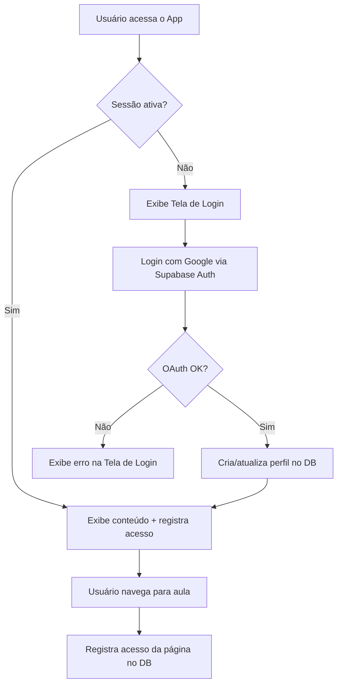
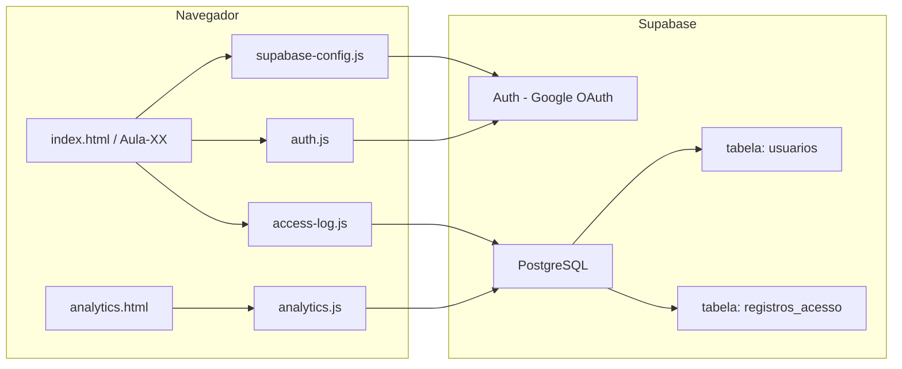
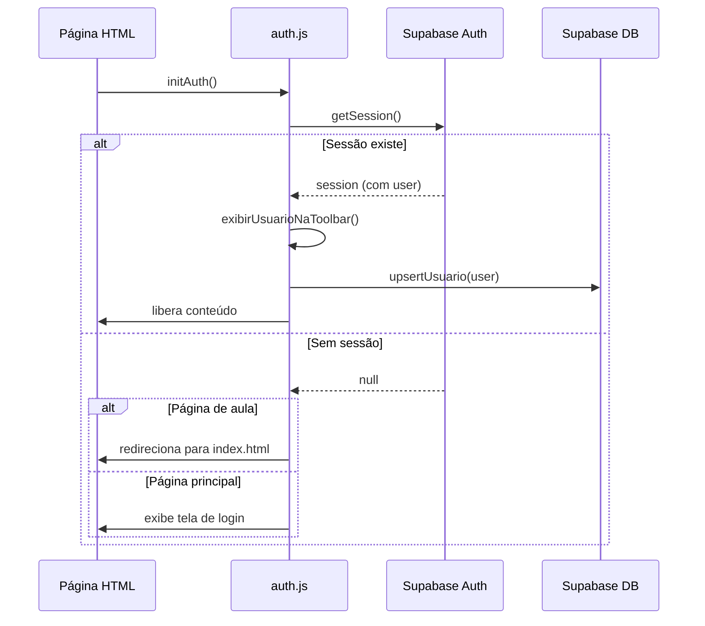

# Documento de Design — Autenticação Google e Analytics

## Visão Geral

Este design descreve a integração do Supabase ao PWA "Inglês com Tio Binho" para adicionar autenticação via Google OAuth e rastreamento de acessos dos alunos. A solução mantém a arquitetura atual (HTML/CSS/JS estático, sem framework) e adiciona uma camada de autenticação client-side usando o SDK `supabase-js` via CDN.

O sistema é composto por três partes principais:
1. **Autenticação** — Login com Google via Supabase Auth, gerenciamento de sessão e proteção de rotas.
2. **Registro de Acessos** — Gravação automática de logs de acesso (quem, quando, qual página) no banco PostgreSQL do Supabase.
3. **Painel de Analytics** — Página administrativa para visualizar estatísticas de uso e engajamento.



## Arquitetura

### Visão Geral da Arquitetura

A arquitetura segue o modelo client-side puro, onde todo o código roda no navegador. O Supabase atua como BaaS (Backend as a Service), fornecendo autenticação OAuth e banco de dados PostgreSQL com Row Level Security (RLS).



### Decisões de Arquitetura

| Decisão | Justificativa |
|---------|---------------|
| SDK Supabase via CDN | Mantém a arquitetura sem bundler/framework do projeto. Carregamento direto via `<script>`. |
| Arquivo `supabase-config.js` separado | Isola credenciais (URL + anon key) em um único ponto. A anon key é pública por design do Supabase. |
| Módulo `auth.js` compartilhado | Centraliza lógica de autenticação, verificação de sessão e proteção de rotas. Incluído em todas as páginas. |
| Módulo `access-log.js` separado | Responsabilidade única: registrar acessos. Falhas de log não bloqueiam o app. |
| RLS no Supabase | Segurança no nível do banco. Cada usuário só lê seus dados; admins leem tudo. |
| Painel de Analytics como página separada (`analytics.html`) | Evita poluir as páginas de aula. Acesso restrito a admins. |
| Login via redirect (não popup) | Mais confiável em PWAs standalone, onde popups podem não funcionar corretamente. |

## Componentes e Interfaces

### 1. `supabase-config.js` — Configuração do Cliente Supabase

Responsável por inicializar o cliente Supabase com as credenciais do projeto.

```javascript
// supabase-config.js
const SUPABASE_URL = 'https://SEU-PROJETO.supabase.co';
const SUPABASE_ANON_KEY = 'sua-anon-key-publica';

const supabase = window.supabase.createClient(SUPABASE_URL, SUPABASE_ANON_KEY);
```

**Interface exposta:** variável global `supabase` (cliente Supabase).

### 2. `auth.js` — Módulo de Autenticação

Centraliza toda a lógica de autenticação e proteção de rotas.

**Funções principais:**

| Função | Descrição |
|--------|-----------|
| `initAuth()` | Verifica sessão existente. Se não há sessão, redireciona para login ou exibe tela de login. |
| `loginComGoogle()` | Inicia o fluxo OAuth com Google via `supabase.auth.signInWithOAuth()`. |
| `logout()` | Encerra a sessão via `supabase.auth.signOut()` e redireciona para login. |
| `getUsuarioAtual()` | Retorna os dados do usuário autenticado (nome, email, foto). |
| `exibirUsuarioNaToolbar()` | Renderiza nome e foto do usuário na toolbar. |
| `verificarAdmin(email)` | Verifica se o email do usuário está na lista de administradores. |
| `upsertUsuario(user)` | Cria ou atualiza o perfil do usuário na tabela `usuarios`. |

**Fluxo de inicialização (executado em todas as páginas):**



### 3. `access-log.js` — Módulo de Registro de Acessos

Responsável por registrar cada acesso no banco de dados.

**Funções principais:**

| Função | Descrição |
|--------|-----------|
| `registrarAcesso(pagina)` | Insere um registro na tabela `registros_acesso` com o ID do usuário, nome, email, página e timestamp. |

**Comportamento:**
- Chamado automaticamente após autenticação bem-sucedida em `auth.js`.
- Chamado ao carregar cada página de aula.
- Falhas são silenciosas (console.warn) — nunca bloqueiam o uso do app.
- A página é detectada automaticamente via `window.location.pathname`.

### 4. `analytics.html` + `analytics.js` — Painel de Analytics

Página administrativa para visualizar dados de uso.

**Componentes do painel:**

| Componente | Descrição |
|------------|-----------|
| Card: Total de Usuários | Contagem de registros únicos na tabela `usuarios`. |
| Lista/Gráfico: Acessos por Dia | Agrupamento de `registros_acesso` por data. |
| Tabela: Lista de Usuários | Nome, email, primeiro acesso, último acesso, total de acessos. |
| Filtro de Período | Seletor de data início/fim para filtrar os dados. |

**Proteção de acesso:**
- Ao carregar, `analytics.js` verifica se o usuário autenticado é admin.
- Se não for admin, redireciona para `index.html`.
- A lista de emails de admin é definida em `supabase-config.js`.

### 5. Design Visual da Tela de Login

A tela de login deve ser visualmente integrada com a identidade do app, usando os mesmos elementos visuais (logo, cores, gradientes, fonte DM Sans). Deve ser bonita, acolhedora e extremamente simples de usar.

**Layout da Tela de Login:**

```
┌─────────────────────────────────────────┐
│  ┌─────────────────────────────────┐    │
│  │     [Logo Tio Binho - icone]    │    │
│  │                                 │    │
│  │   Inglês com Tio Binho          │    │
│  │                                 │    │
│  │   "Sua jornada no inglês        │    │
│  │    começa aqui! 🚀"             │    │
│  │                                 │    │
│  │  ┌───────────────────────────┐  │    │
│  │  │ 🔵 Entrar com Google     │  │    │
│  │  └───────────────────────────┘  │    │
│  │                                 │    │
│  │   [mensagem de erro, se houver] │    │
│  │                                 │    │
│  │   Acesse com sua conta Google   │    │
│  │   para começar a aprender       │    │
│  └─────────────────────────────────┘    │
│                                         │
│  [imagem capa.png como background]      │
└─────────────────────────────────────────┘
```

**Especificações visuais:**

| Elemento | Estilo |
|----------|--------|
| Background | Gradiente do app: `linear-gradient(135deg, #FF6B6B 0%, #4ECDC4 50%, #FFD93D 100%)` com overlay semi-transparente |
| Card central | Fundo branco, `border-radius: 20px`, `box-shadow` suave, centralizado vertical e horizontalmente |
| Logo | Imagem `icone-192.png` (ou `tiobinho.png`) centralizada no topo do card, tamanho ~120px |
| Título | "Inglês com Tio Binho" em DM Sans 700, cor `#333` |
| Subtítulo | Frase motivacional em DM Sans 400, cor `#666` |
| Botão Google | Fundo branco com borda `#dadce0`, ícone do Google à esquerda, texto "Entrar com Google" em `#3c4043`, hover com sombra. Segue o padrão visual do Google Sign-In. |
| Mensagem de erro | Texto vermelho `#e63946` abaixo do botão, visível apenas quando há erro |
| Texto auxiliar | "Acesse com sua conta Google para começar a aprender" em DM Sans 400, cor `#999`, tamanho menor |
| Responsividade | Card ocupa 90% da largura em mobile (max-width: 420px), centralizado em desktop |

**Comportamento:**
- A tela de login substitui todo o conteúdo da página principal quando não há sessão ativa
- O conteúdo do app (seções, aulas, progresso) fica com `display: none`
- Após login bem-sucedido, a tela de login desaparece e o conteúdo aparece com uma transição suave
- Em caso de erro, a mensagem aparece com animação de fade-in

### 6. Modificações em Páginas Existentes

**`index.html` (página principal):**
- Adicionar `<script>` tags para SDK Supabase (CDN), `supabase-config.js`, `auth.js`, `access-log.js`.
- Adicionar container para tela de login (inicialmente visível).
- Adicionar container para info do usuário na toolbar (nome + foto + botão sair).
- O conteúdo existente fica com `display: none` até autenticação.

**`Aula-XX/index.html` (páginas de aula):**
- Adicionar os mesmos `<script>` tags (com caminhos relativos `../`).
- Conteúdo fica oculto até `auth.js` confirmar sessão ativa.
- Se sem sessão, redireciona para `../index.html`.

**`sw.js` (Service Worker):**
- Adicionar novos arquivos ao cache: `supabase-config.js`, `auth.js`, `access-log.js`, `analytics.html`, `analytics.js`.
- Incrementar `CACHE_NAME` para forçar atualização.
- Requisições para `*.supabase.co` devem ser excluídas do cache (sempre network).

**`style.css`:**
- Adicionar estilos para tela de login (`.login-container`, `.login-btn-google`).
- Adicionar estilos para info do usuário na toolbar (`.user-info`, `.user-avatar`).
- Adicionar estilos para painel de analytics (`.analytics-*`).

### 7. Estrutura de Arquivos (Novos e Modificados)

```
├── supabase-config.js    ← NOVO: configuração do cliente Supabase
├── auth.js               ← NOVO: lógica de autenticação e proteção de rotas
├── access-log.js         ← NOVO: registro de acessos no banco
├── analytics.html        ← NOVO: página do painel de analytics
├── analytics.js          ← NOVO: lógica do painel de analytics
├── index.html            ← MODIFICADO: adicionar scripts + tela de login
├── style.css             ← MODIFICADO: estilos de login, user info, analytics
├── sw.js                 ← MODIFICADO: cachear novos arquivos, excluir Supabase
├── Aula-01/index.html    ← MODIFICADO: adicionar scripts de auth
├── Aula-02/index.html    ← MODIFICADO: adicionar scripts de auth
├── Aula-03/index.html    ← MODIFICADO: adicionar scripts de auth
```

## Modelos de Dados

### Tabela `usuarios`

Armazena o perfil dos alunos que acessam o app.

| Coluna | Tipo | Descrição |
|--------|------|-----------|
| `id` | `UUID` (PK) | Referência ao `auth.users.id` do Supabase. |
| `nome` | `TEXT` | Nome completo do Google. |
| `email` | `TEXT` (UNIQUE) | Email do Google. |
| `foto_url` | `TEXT` | URL da foto de perfil do Google. |
| `primeiro_acesso` | `TIMESTAMPTZ` | Data/hora do primeiro login. Default: `now()`. |
| `ultimo_acesso` | `TIMESTAMPTZ` | Data/hora do login mais recente. Atualizado a cada login. |

**SQL de criação:**

```sql
CREATE TABLE usuarios (
    id UUID PRIMARY KEY REFERENCES auth.users(id) ON DELETE CASCADE,
    nome TEXT NOT NULL,
    email TEXT UNIQUE NOT NULL,
    foto_url TEXT,
    primeiro_acesso TIMESTAMPTZ DEFAULT now(),
    ultimo_acesso TIMESTAMPTZ DEFAULT now()
);

ALTER TABLE usuarios ENABLE ROW LEVEL SECURITY;

-- Usuário lê apenas seu próprio registro
CREATE POLICY "Usuarios: leitura própria"
    ON usuarios FOR SELECT
    USING (auth.uid() = id);

-- Usuário pode inserir/atualizar apenas seu próprio registro
CREATE POLICY "Usuarios: upsert próprio"
    ON usuarios FOR INSERT
    WITH CHECK (auth.uid() = id);

CREATE POLICY "Usuarios: update próprio"
    ON usuarios FOR UPDATE
    USING (auth.uid() = id);

-- Admins leem todos os registros (via função RPC ou service role)
-- A leitura de todos os dados para o painel de analytics será feita
-- via funções RPC (database functions) que rodam com SECURITY DEFINER,
-- permitindo que admins acessem dados agregados sem expor a tabela inteira.
```

### Tabela `registros_acesso`

Armazena cada acesso individual ao app.

| Coluna | Tipo | Descrição |
|--------|------|-----------|
| `id` | `BIGSERIAL` (PK) | Identificador auto-incremento. |
| `usuario_id` | `UUID` (FK) | Referência à tabela `usuarios`. |
| `nome` | `TEXT` | Nome do usuário no momento do acesso. |
| `email` | `TEXT` | Email do usuário no momento do acesso. |
| `pagina` | `TEXT` | Caminho da página acessada (ex: `/Aula-01/index.html`). |
| `acessado_em` | `TIMESTAMPTZ` | Timestamp do acesso. Default: `now()`. |

**SQL de criação:**

```sql
CREATE TABLE registros_acesso (
    id BIGSERIAL PRIMARY KEY,
    usuario_id UUID NOT NULL REFERENCES usuarios(id) ON DELETE CASCADE,
    nome TEXT NOT NULL,
    email TEXT NOT NULL,
    pagina TEXT NOT NULL,
    acessado_em TIMESTAMPTZ DEFAULT now()
);

ALTER TABLE registros_acesso ENABLE ROW LEVEL SECURITY;

-- Usuário pode inserir seus próprios registros
CREATE POLICY "Acessos: inserção própria"
    ON registros_acesso FOR INSERT
    WITH CHECK (auth.uid() = usuario_id);

-- Usuário lê apenas seus próprios registros
CREATE POLICY "Acessos: leitura própria"
    ON registros_acesso FOR SELECT
    USING (auth.uid() = usuario_id);
```

### Funções RPC para Analytics (Admin)

Para o painel de analytics, usaremos funções PostgreSQL com `SECURITY DEFINER` que verificam se o usuário é admin antes de retornar dados.

```sql
-- Lista de admins (pode ser uma tabela ou hardcoded na função)
CREATE OR REPLACE FUNCTION is_admin()
RETURNS BOOLEAN AS $$
BEGIN
    RETURN EXISTS (
        SELECT 1 FROM auth.users
        WHERE id = auth.uid()
        AND email IN ('admin1@email.com', 'admin2@email.com')
    );
END;
$$ LANGUAGE plpgsql SECURITY DEFINER;

-- Buscar todos os usuários (apenas admin)
CREATE OR REPLACE FUNCTION admin_listar_usuarios()
RETURNS TABLE (
    id UUID, nome TEXT, email TEXT, foto_url TEXT,
    primeiro_acesso TIMESTAMPTZ, ultimo_acesso TIMESTAMPTZ,
    total_acessos BIGINT
) AS $$
BEGIN
    IF NOT is_admin() THEN
        RAISE EXCEPTION 'Acesso negado';
    END IF;
    RETURN QUERY
        SELECT u.id, u.nome, u.email, u.foto_url,
               u.primeiro_acesso, u.ultimo_acesso,
               COUNT(r.id)::BIGINT AS total_acessos
        FROM usuarios u
        LEFT JOIN registros_acesso r ON r.usuario_id = u.id
        GROUP BY u.id;
END;
$$ LANGUAGE plpgsql SECURITY DEFINER;

-- Buscar acessos por período (apenas admin)
CREATE OR REPLACE FUNCTION admin_acessos_por_periodo(
    data_inicio TIMESTAMPTZ,
    data_fim TIMESTAMPTZ
)
RETURNS TABLE (
    dia DATE, total_acessos BIGINT
) AS $$
BEGIN
    IF NOT is_admin() THEN
        RAISE EXCEPTION 'Acesso negado';
    END IF;
    RETURN QUERY
        SELECT DATE(acessado_em) AS dia, COUNT(*)::BIGINT AS total_acessos
        FROM registros_acesso
        WHERE acessado_em BETWEEN data_inicio AND data_fim
        GROUP BY DATE(acessado_em)
        ORDER BY dia;
END;
$$ LANGUAGE plpgsql SECURITY DEFINER;
```

### Índices

```sql
CREATE INDEX idx_registros_acesso_usuario ON registros_acesso(usuario_id);
CREATE INDEX idx_registros_acesso_data ON registros_acesso(acessado_em);
CREATE INDEX idx_registros_acesso_pagina ON registros_acesso(pagina);
```


## Propriedades de Corretude

*Uma propriedade é uma característica ou comportamento que deve ser verdadeiro em todas as execuções válidas de um sistema — essencialmente, uma declaração formal sobre o que o sistema deve fazer. Propriedades servem como ponte entre especificações legíveis por humanos e garantias de corretude verificáveis por máquina.*

### Propriedade 1: Usuário não autenticado vê tela de login

*Para qualquer* estado onde não existe sessão ativa, ao acessar a página principal (index.html), o container de login deve estar visível e o conteúdo das aulas deve estar oculto.

**Valida: Requisitos 1.1, 3.2**

### Propriedade 2: Botão de login inicia OAuth com provedor correto

*Para qualquer* clique no botão "Entrar com Google", a função `signInWithOAuth` do Supabase deve ser chamada com o provedor `'google'` e a URL de redirecionamento correta.

**Valida: Requisito 1.2**

### Propriedade 3: Erro de OAuth exibe mensagem e mantém tela de login

*Para qualquer* erro retornado pelo fluxo OAuth (incluindo cancelamento pelo usuário), a tela de login deve permanecer visível e uma mensagem de erro deve ser exibida ao usuário.

**Valida: Requisito 1.4**

### Propriedade 4: Sessão ativa libera acesso a qualquer página

*Para qualquer* sessão válida e qualquer página do app (principal ou aula), o conteúdo deve ser exibido e a tela de login deve estar oculta.

**Valida: Requisitos 1.3, 2.1, 3.3**

### Propriedade 5: Sem sessão válida, páginas de aula redirecionam para login

*Para qualquer* página de aula (Aula-XX/index.html) e qualquer estado onde a sessão é nula ou expirada, o app deve redirecionar o usuário para a página principal com a tela de login.

**Valida: Requisitos 2.2, 3.1**

### Propriedade 6: Logout encerra sessão e exibe login

*Para qualquer* usuário autenticado, ao executar a ação de logout, a sessão deve ser encerrada (getSession retorna null) e a tela de login deve ser exibida.

**Valida: Requisito 2.3**

### Propriedade 7: Toolbar exibe dados do usuário autenticado

*Para qualquer* usuário autenticado com nome e foto de perfil, a toolbar deve conter o nome do usuário e a URL da foto renderizada como imagem.

**Valida: Requisito 2.4**

### Propriedade 8: Acesso autenticado gera registro completo no banco

*Para qualquer* usuário autenticado e qualquer página acessada, um registro deve ser inserido na tabela `registros_acesso` contendo o ID do usuário, nome, email, caminho da página e timestamp não-nulo.

**Valida: Requisitos 4.1, 4.2, 4.3**

### Propriedade 9: Falha no registro de acesso não bloqueia o app

*Para qualquer* erro durante a inserção de um registro de acesso (erro de rede, banco indisponível), o app deve continuar funcionando normalmente — o conteúdo permanece visível e nenhuma exceção não tratada é lançada.

**Valida: Requisito 4.4**

### Propriedade 10: Upsert de usuário — primeiro login cria, login subsequente atualiza sem duplicar

*Para qualquer* usuário, ao fazer login N vezes (N ≥ 1), a tabela `usuarios` deve conter exatamente 1 registro para aquele email, com `primeiro_acesso` igual ao timestamp do primeiro login e `ultimo_acesso` igual ao timestamp do login mais recente.

**Valida: Requisitos 5.1, 5.2, 5.3**

### Propriedade 11: Painel de analytics exibe dados corretos dos usuários

*Para qualquer* conjunto de usuários no banco, o painel de analytics deve listar todos os usuários com nome, email, data do primeiro acesso, data do último acesso e total de acessos, onde o total de acessos corresponde à contagem real de registros na tabela `registros_acesso` para aquele usuário.

**Valida: Requisitos 6.1, 6.3, 6.4**

### Propriedade 12: Filtro de período retorna apenas acessos dentro do intervalo

*Para qualquer* intervalo de datas [início, fim] e qualquer conjunto de registros de acesso, a função de filtragem deve retornar apenas registros cujo `acessado_em` está dentro do intervalo, e a contagem diária deve somar ao total de registros filtrados.

**Valida: Requisitos 6.2, 6.5**

### Propriedade 13: Painel de analytics acessível apenas para administradores

*Para qualquer* usuário não-administrador, ao tentar acessar o painel de analytics, o app deve redirecionar para a página principal. *Para qualquer* administrador, o painel deve ser carregado normalmente.

**Valida: Requisito 6.6**

### Propriedade 14: RLS impede leitura de dados de outros usuários

*Para qualquer* usuário autenticado não-admin, consultas às tabelas `usuarios` e `registros_acesso` devem retornar apenas registros pertencentes a esse usuário. Registros de outros usuários nunca devem ser retornados.

**Valida: Requisito 7.5**

## Tratamento de Erros

| Cenário | Comportamento | Impacto no Usuário |
|---------|---------------|-------------------|
| OAuth falha ou cancelado | Exibe mensagem de erro na tela de login. Usuário pode tentar novamente. | Nenhum — permanece na tela de login. |
| Sessão expira durante uso | Na próxima navegação, detecta sessão inválida e redireciona para login. | Precisa fazer login novamente. |
| Falha ao gravar registro de acesso | `console.warn` com detalhes do erro. App continua normalmente. | Nenhum — acesso não é bloqueado. |
| Falha ao fazer upsert do usuário | `console.warn`. Sessão continua válida. Dados podem ficar desatualizados. | Nenhum — pode usar o app normalmente. |
| Supabase SDK não carrega (CDN offline) | App detecta `window.supabase` undefined. Exibe mensagem de erro de conexão. | Não consegue fazer login. Se já tem cache, pode ver conteúdo offline. |
| App offline sem sessão | Exibe mensagem informando necessidade de conexão para login. | Não consegue acessar. |
| App offline com sessão ativa | Service Worker serve conteúdo cacheado. Logs de acesso ficam pendentes (não são gravados). | Pode usar conteúdo cacheado normalmente. |
| Usuário não-admin tenta acessar analytics | Redireciona para página principal. | Não vê o painel. |
| Função RPC de admin falha | Exibe mensagem de erro no painel de analytics. | Admin vê mensagem de erro, pode tentar novamente. |

## Estratégia de Testes

### Abordagem Dual: Testes Unitários + Testes Baseados em Propriedades

A estratégia de testes combina testes unitários (exemplos específicos e edge cases) com testes baseados em propriedades (verificação universal com inputs gerados aleatoriamente). Ambos são complementares e necessários.

### Biblioteca de Testes

- **Framework de testes:** Vitest (compatível com o ecossistema JS sem framework)
- **Testes baseados em propriedades:** `fast-check` (biblioteca PBT para JavaScript)
- **Configuração:** Mínimo de 100 iterações por teste de propriedade

### Testes Baseados em Propriedades

Cada propriedade de corretude do design deve ser implementada como um único teste baseado em propriedades usando `fast-check`. Cada teste deve ser anotado com um comentário referenciando a propriedade do design.

**Formato de tag:** `Feature: google-auth-analytics, Property {número}: {título}`

**Propriedades a implementar:**

1. **Property 1:** Gerar estados aleatórios de sessão (null/undefined/expirada) e verificar que a tela de login é exibida.
2. **Property 2:** Gerar cliques e verificar que `signInWithOAuth` é chamado com `{ provider: 'google' }`.
3. **Property 3:** Gerar erros OAuth aleatórios e verificar que a mensagem de erro aparece e o login permanece visível.
4. **Property 4:** Gerar sessões válidas aleatórias e páginas aleatórias, verificar que o conteúdo é liberado.
5. **Property 5:** Gerar páginas de aula aleatórias com sessão nula, verificar redirecionamento.
6. **Property 6:** Gerar usuários autenticados, executar logout, verificar sessão nula e login visível.
7. **Property 7:** Gerar perfis de usuário aleatórios (nome, foto_url), verificar que a toolbar contém esses dados.
8. **Property 8:** Gerar combinações aleatórias de usuário + página, verificar que o registro inserido contém todos os campos obrigatórios.
9. **Property 9:** Gerar erros aleatórios de inserção, verificar que nenhuma exceção é propagada e o conteúdo permanece visível.
10. **Property 10:** Gerar sequências aleatórias de logins (1 a N) para o mesmo usuário, verificar que existe exatamente 1 registro e que `primeiro_acesso` ≤ `ultimo_acesso`.
11. **Property 11:** Gerar conjuntos aleatórios de usuários e registros de acesso, verificar que o painel lista todos com contagens corretas.
12. **Property 12:** Gerar intervalos de datas aleatórios e conjuntos de registros, verificar que apenas registros dentro do intervalo são retornados.
13. **Property 13:** Gerar usuários aleatórios (admin e não-admin), verificar acesso/redirecionamento correto ao painel.
14. **Property 14:** Gerar pares de usuários e registros de outros usuários, verificar que consultas RLS não retornam dados alheios.

### Testes Unitários

Testes unitários devem focar em exemplos específicos, edge cases e integrações:

- **Login:** Verificar que o botão de login existe e está visível na tela de login.
- **Sessão:** Testar restauração de sessão com token válido específico.
- **Offline:** Verificar mensagem de offline quando `navigator.onLine === false`.
- **Service Worker:** Verificar que a lista de cache em `sw.js` inclui os novos arquivos (`supabase-config.js`, `auth.js`, `access-log.js`).
- **Schema:** Verificar que as tabelas `usuarios` e `registros_acesso` existem com as colunas esperadas.
- **Analytics:** Testar renderização do painel com dados vazios (0 usuários, 0 acessos).
- **Edge case:** Usuário com foto_url nula — toolbar deve exibir avatar padrão.
- **Edge case:** Página com caminho muito longo — registro de acesso deve truncar ou aceitar.
