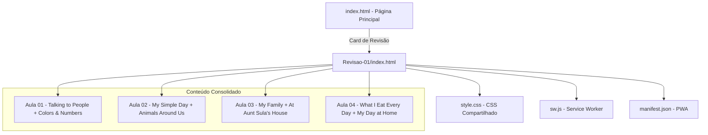

# Documento de Design — Sessão de Revisão Semanal

## Visão Geral

A Sessão de Revisão Semanal é uma página HTML dedicada que consolida todo o conteúdo das Aulas 01 a 04 (Bloco 1, Semanas 1 a 4) do curso "Inglês com Tio Binho". A página segue o mesmo padrão visual e estrutural das páginas de aula existentes, utilizando o CSS compartilhado (`style.css`), e é acessada através de um card especial na grade de aulas da página principal.

A primeira revisão (Revisao-01) cobre 8 textos, ~1.284 palavras estudadas de 8.160 totais, e inclui vídeo resumo, lista de textos, contagem de palavras com barra de progresso, e seções detalhadas de vocabulário consolidado.

## Arquitetura



A arquitetura é simples: uma página HTML estática dentro da pasta `Revisao-01/`, que referencia os mesmos assets compartilhados do projeto (CSS, fontes, ícones, service worker). Não há lógica de backend — todo o conteúdo é estático e renderizado no cliente.

### Decisões de Design

1. **Página única sem abas**: Diferente das páginas de aula que usam abas (Guia/Texto 1/Texto 2), a revisão é uma página de scroll contínuo com seções bem definidas. Isso facilita a revisão completa sem navegação extra.

2. **Card full-width na grade**: O card de revisão ocupa toda a largura do grid (`grid-column: 1 / -1`) para se destacar visualmente das aulas regulares.

3. **Gradiente distinto**: O card usa um gradiente roxo/azul (`#667eea` → `#764ba2`) que não existe na paleta de aulas, criando diferenciação visual imediata.

4. **URL placeholder para YouTube**: O iframe do vídeo usa uma URL placeholder (`https://www.youtube.com/embed/VIDEO_ID_AQUI`) que pode ser facilmente substituída quando o vídeo estiver pronto.

## Componentes e Interfaces

### 1. Card de Revisão (index.html)

Inserido na `aulas-grid` da página principal, após o card da Aula 04:

```html
<!-- Card de Revisão - Bloco 1 -->
<div class="aula-card revisao-card" style="grid-column: 1 / -1; background: linear-gradient(135deg, #667eea 0%, #764ba2 100%);">
    <h3>📝 Revisão — Semanas 1 a 4</h3>
    <p><strong>Bloco 1</strong></p>
    <div class="textos">
        📖 Talking to People · Colors and Numbers<br>
        📖 My Simple Day · Animals Around Us<br>
        📖 My Family · At Aunt Sula's House<br>
        📖 What I Eat Every Day · My Day at Home
    </div>
    <a href="Revisao-01/index.html" class="btn">📚 Acessar</a>
</div>
```

### 2. Página da Revisão (Revisao-01/index.html)

Estrutura HTML completa com as seguintes seções em scroll contínuo:

#### 2.1 Head + Toolbar + Breadcrumb
- Mesmo padrão das páginas de aula
- Breadcrumb: `🏠 Home › Revisão 01`

#### 2.2 Seção: Cabeçalho da Revisão
- Título: "📝 Revisão — Bloco 1 (Semanas 1 a 4)"
- Subtítulo com estatísticas: "8 textos estudados · 1.284 palavras · 4 semanas"

#### 2.3 Seção: Vídeo Resumo
- Iframe YouTube responsivo (16:9) com wrapper
- Título acima do player: "🎬 Vídeo Resumo do Bloco 1"
- Mensagem de fallback caso o vídeo não esteja disponível

```html
<div class="video-wrapper" style="position: relative; padding-bottom: 56.25%; height: 0; overflow: hidden; border-radius: 12px;">
    <iframe src="https://www.youtube.com/embed/VIDEO_ID_AQUI" 
            style="position: absolute; top: 0; left: 0; width: 100%; height: 100%; border: none;"
            allow="accelerometer; autoplay; clipboard-write; encrypted-media; gyroscope; picture-in-picture" 
            allowfullscreen></iframe>
</div>
<p style="text-align: center; color: #999; font-size: 0.9em; margin-top: 10px;">
    ⏳ Vídeo será adicionado em breve!
</p>
```

#### 2.4 Seção: Textos Estudados
Cards agrupados por aula, cada um com link para a página da aula correspondente:

| Aula | Semana | Texto 1 | Texto 2 |
|------|--------|---------|---------|
| Aula 01 | Semana 1 | Talking to People | Colors and Numbers in Real Life |
| Aula 02 | Semana 2 | My Simple Day | Animals Around Us |
| Aula 03 | Semana 3 | My Family | At Aunt Sula's House |
| Aula 04 | Semana 4 | What I Eat Every Day | My Day at Home |

Cada card de aula usa o gradiente correspondente da paleta e contém links clicáveis para as páginas de aula.

#### 2.5 Seção: Palavras Aprendidas (Progresso)
- Número total: 1.284 de 8.160
- Barra de progresso visual (15.7%)
- Cards informativos: palavras estudadas, histórias lidas, semanas completadas

#### 2.6 Seção: Pontos Importantes — Vocabulário Consolidado

Esta é a seção mais extensa da revisão, com cards detalhados para cada categoria:

**Card 1: Verbos de Conversação (Aula 01)**
25 verbos: talk, speak, learn, ask, answer, listen, understand, practice, feel, know, enjoy, prefer, study, remember, forget, plan, travel, visit, hope, arrive, wait, choose, stay, meet, improve

**Card 2: Números e Cores (Aula 01)**
Números 0-20, 10 cores básicas (white, black, gray, brown, red, green, blue, yellow, orange, pink) + 3 compostas (light yellow, dark blue, dark gray)

**Card 3: Verbos Essenciais do Dia a Dia (Aula 02)**
29 verbos: be, have, do, go, come, like, want, need, know, think, see, take, make, work, live, eat, drink, buy, use, say, get, give, help, try, find, call, feel, leave, start, stop

**Card 4: Animais (Aula 02)**
15 animais organizados por habitat:
- Casa: dog, cat
- Fazenda: cow, horse, pig, chicken, duck
- Floresta: lion, tiger, elephant, monkey, bird
- Oceano: fish, shark, whale

**Card 5: Família e Descrição Física (Aula 03)**
- Família: parents, mother, father, older brother, uncle, grandmother
- Descrição: short, tall, thin, funny, cute, dedicated
- Atividades: takes care of, washes and irons, leaves home, comes back

**Card 6: Atividades e Expressões (Aula 03)**
- Verbos: watch, draw, paint, play, look for, feed, dig
- Expressões: anyway, look for, the other day, every visit, I love him anyway

**Card 7: Comida e Refeições (Aula 04)**
- Comida: bread, butter, milk, scrambled eggs, orange juice, sandwich, cookies, rice, beans, pot roast, salad, vegetables, soup, carrots, potatoes, pasta, meat, garlic bread, barbecue
- Frutas: banana, apple, pear, strawberries
- Refeições: breakfast, lunch, dinner, snack time
- Verbos: bring, cook, try, grow, give
- Expressões: have breakfast, enough for seconds, a little bit, get hungry, for the first time

**Card 8: Higiene Pessoal (Aula 04)**
- Ações: take a shower, wash, brush teeth, comb hair, flush toilet, dry
- Objetos: soap, towel, mirror, toothbrush, bathroom, pajamas

**Card 9: Clima e Tempo (Aula 04)**
- Clima: sun, rain, fog, clouds, sky, weather, hot, cold, humid
- Expressões: it starts to rain, it looks like, time to get up

**Card 10: Quintal e Casa (Aula 04)**
- Lugares: backyard, grass, trees, flowers, roof, window, puddles
- Verbos: wake up, rub, yawn, wash, brush, dry, comb, flush, run, jump, laugh, change, appear, cover, bark, put on, shine
- Expressões: Time to get up, take a shower, brush my teeth, flush the toilet, get out of, doesn't let me

#### 2.7 Seção: Expressões-Chave do Bloco
Tabela consolidada das expressões mais importantes com exemplo e tradução:

| Expressão | Exemplo | Tradução |
|-----------|---------|----------|
| Nice to meet you | Nice to meet you! | Prazer em conhecer você! |
| I don't like... | I don't like tea | Eu não gosto de chá |
| Takes care of | She takes care of our house | Ela cuida da nossa casa |
| I can't wait! | Tomorrow we visit grandma. I can't wait! | Mal posso esperar! |
| Look for | We look for worms | Procurar |
| The other day | The other day I found a worm | Outro dia |
| I love him anyway | Pipoca is grumpy but I love him anyway | Eu adoro ele do mesmo jeito |
| Have breakfast | I have breakfast in the kitchen | Tomar café da manhã |
| Get hungry | I get hungry in the afternoon | Ficar com fome |
| A little bit | I eat a little bit of salad | Um pouquinho |
| For the first time | I tried sushi for the first time | Pela primeira vez |
| Time to get up! | My mom says: Time to get up! | Hora de levantar! |
| Take a shower | I take a shower every morning | Tomar banho |
| It starts to rain | Suddenly, it starts to rain! | Começa a chover |
| Doesn't let me | My mom doesn't let me | Não me deixa |
| It looks like | It looks like magic! | Parece |

#### 2.8 Footer
- Mesmo padrão das páginas de aula
- Mensagem: "Revisão 01 — Bloco 1 (Semanas 1 a 4)"

#### 2.9 JavaScript
- Registro do Service Worker (`../sw.js`)
- Banner de instalação PWA
- Botão voltar ao topo
- Sem lógica de abas (página de scroll contínuo)

## Modelo de Dados

Não há modelo de dados persistente. Todo o conteúdo é estático no HTML. Para escalabilidade futura (Requisito 8), os dados parametrizáveis de cada revisão são:

```
Revisão:
  - número: 01
  - bloco: 1
  - semanas: "1 a 4"
  - aulas: [01, 02, 03, 04]
  - textos: [lista de 8 textos com título e link]
  - palavrasEstudadas: 1284
  - palavrasTotal: 8160
  - historiasEstudadas: 8
  - historiasTotal: 96
  - semanasCompletadas: 4
  - semanasTotal: 48
  - videoYoutubeId: "VIDEO_ID_AQUI"
  - vocabulario: [categorias com listas de palavras]
  - expressoes: [lista de expressões-chave]
```

Para criar a Revisao-02, basta copiar a estrutura e substituir esses dados.

## Tratamento de Erros

| Cenário | Tratamento |
|---------|------------|
| Vídeo YouTube indisponível | Mensagem "⏳ Vídeo será adicionado em breve!" abaixo do iframe |
| Link de aula quebrado | Links relativos (`../Aula-XX/index.html`) seguem o padrão existente |
| CSS não carrega | Conteúdo permanece legível com HTML semântico |
| Service Worker falha | Página funciona normalmente sem cache offline |
| Tela muito pequena (<480px) | Layout responsivo com media queries existentes no style.css |

## Estratégia de Testes

Esta feature consiste em páginas HTML estáticas com CSS — não há lógica de negócio, funções puras ou transformações de dados. Portanto, **property-based testing (PBT) não se aplica** a esta feature.

PBT não é apropriado porque:
- O conteúdo é HTML/CSS estático renderizado pelo navegador
- Não há funções com input/output variável para testar
- Não há serialização, parsing ou transformação de dados
- O comportamento é determinístico e visual

### Testes Recomendados

1. **Testes manuais visuais**: Verificar renderização em diferentes tamanhos de tela (desktop, tablet, mobile)
2. **Verificação de links**: Confirmar que todos os links para aulas funcionam corretamente
3. **Validação HTML**: Usar W3C Validator para garantir HTML válido
4. **Responsividade**: Testar em 1200px, 768px e 480px de largura
5. **PWA**: Verificar registro do service worker e banner de instalação
6. **Cross-browser**: Testar em Chrome, Safari e Firefox
